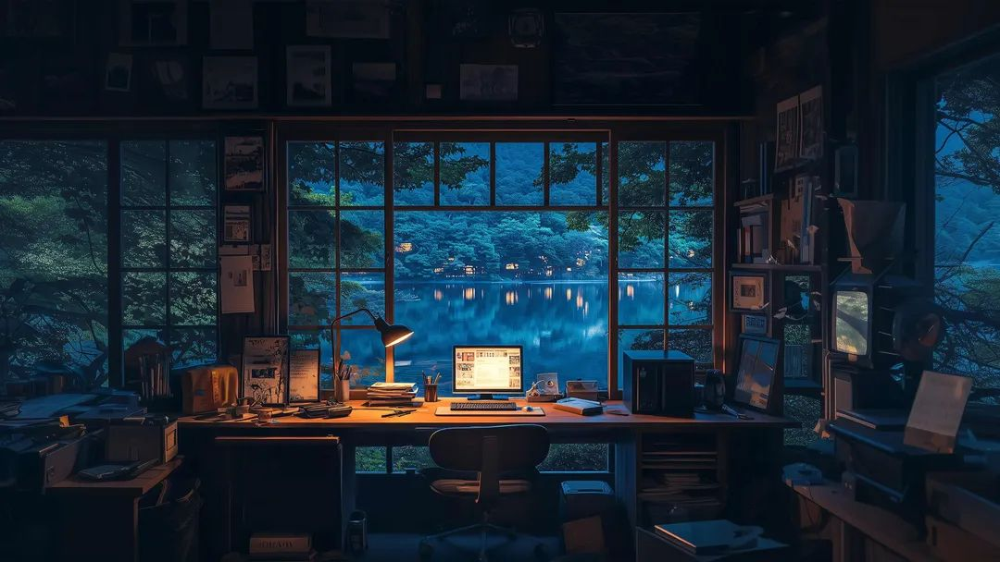

  

<h1 align="center">
  
    𝐇𝐞𝐥𝐥𝐨, &lt;everynyan/&gt;!
  
</h1>

#  About Me 👨‍💻

<h2>I’m Dmitry — and here’s my lore 👾</h2> 

- 📠University guy, still pretending I know what’s going on. . .  
- 💾 C++ is not just a language, it’s a lifestyle. (yes, I dream in pointers)  
- ⚡ Favorite bug-fix strategy: <code>sudo rm -rf /</code> (try this one!)  
- 🧠Linux enjoyer (still googling *“how to exit vimâ€*)  
- 🧠 Who endlessly allocates memory?... (me 
  )

## 🛠️ TECHNICAL SKILLS 🛠️

